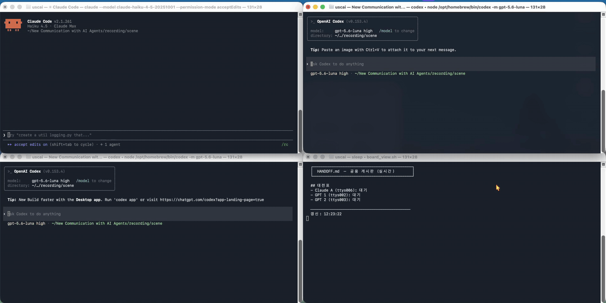

# 이기종 AI 에이전트 터미널 협업

**Claude Code와 OpenAI Codex CLI는 서로 말을 못 한다. 그런데 같은 Mac에 떠 있다.**
터미널에 대신 타이핑하고, 마크다운 파일 한 장을 게시판으로 쓰면 둘이 협업한다. 추가 소프트웨어는 없다.



위 15초는 실제 기록이다. 지시 하나가 세 터미널에 동시에 날아가고, 서로 다른 회사의 모델 셋이
같은 코드를 리뷰하면서 가위바위보를 한 판 벌인다. 각자 **자기 줄 한 줄만** 고친다.

---

## 1. 무엇이 오가는가

| 채널 | 방향 | 수단 | 성질 |
|---|---|---|---|
| **L1** 세션 메시지 | Claude ↔ Claude | Claude Code 내장 `SendMessage` | 즉시·양방향. Codex엔 없음 |
| **L2** 터미널 타이핑 | 누구든 → 누구든 | `bin/send_to_tty.sh` (AppleScript) | push. 지시를 밀어넣는 통로 |
| **L2'** 화면 읽기 | 관찰 | `bin/read_tty.sh` | 상대 화면 마지막 N자 |
| **L3** 게시판 파일 | 전원 ↔ 전원 | `HANDOFF.md` | 유일한 공용·영구 채널 |

원리 한 줄: **서로 다른 도구는 메시지 API를 공유하지 않지만, 디스크와 터미널 앱은 공유한다.**

## 2. 5분 레시피

```sh
# 1) 누가 어느 tty에 떠 있나
bin/list_agents.sh
#  84436 ttys000 claude
#  84461 ttys001 …/bin/codex

# 2) 게시판 만들기
bin/handoff_init.sh ~/my-project

# 3) 지시 밀어넣기
bin/send_to_tty.sh /dev/ttys001 "HANDOFF.md 읽고 너는 GPT 1이다. T-2를 수행하고 자기 줄만 갱신하라."

# 4) 게시판 감시
bin/watch_board.sh ~/my-project/HANDOFF.md "^- "
```

`send_to_tty.sh`의 핵심은 두 줄이다.

```applescript
do script msg in t     -- 입력창에 타이핑
delay 0.5
do script "" in t      -- ★ Enter. 이게 없으면 Codex 입력창에 글자만 남는다
```

## 3. 게시판 규약

1. 작업마다 `[담당: X]`와 **전용 경로**를 적는다. 여럿이 동시에 써도 충돌하지 않는다.
2. 담당자는 `## 상태 보고`의 **자기 줄 한 줄만** 갱신한다.
   형식: `DONE/진행/막힘 — 산출물 경로, 핵심 수치, 변경 파일`
3. 키·비밀은 게시판·로그·커밋 어디에도 적지 않는다.
4. 막히면 `막힘 — 사유`를 쓰고 멈춘다. 남의 담당을 대신 하지 않는다.
5. `AGENTS.md`(Codex 자동 로드)와 `CLAUDE.md`(Claude 자동 로드)에는 "게시판 먼저"만 적는다.

---

## 4. 퍼미션 이슈 — 여기서 대부분 막힌다

에이전트가 조용하면 십중팔구 **모달에 걸려 입력을 못 받는 상태**다. 프로세스는 살아 있고
`send_to_tty.sh`도 `sent`를 돌려주지만, 글자가 TUI에 닿지 않는다. 순서대로 확인한다.

### 4-1. 폴더 신뢰 프롬프트 (가장 흔함)

새 폴더에서 처음 뜨면 둘 다 신뢰 여부를 묻고, **그 모달이 입력을 삼킨다.**

| | 화면 | 기본 선택 | 통과 방법 |
|---|---|---|---|
| **Codex** | `Do you trust the contents of this directory?` | `1. Yes, continue` | `send_to_tty.sh /dev/ttysNNN ""` — 빈 문자열이 Enter |
| **Claude Code** | `Is this a project you created or one you trust?` | `No, exit` ⚠️ | 그냥 Enter 누르면 **종료된다.** 아래 화살표 먼저 |

Claude 쪽은 화살표가 필요해서 `do script`로는 안 된다. 다른 에이전트가 대신 눌러주려면:

```sh
osascript -e 'tell application "Terminal"
  repeat with w in windows
    repeat with t in tabs of w
      if (tty of t) is "/dev/ttys001" then set frontmost of w to true
    end repeat
  end repeat
end tell
delay 1
tell application "System Events"
  key code 125
  delay 0.3
  key code 36
end tell'
```

`key code 125`는 아래 화살표, `36`은 Enter다. **손이 자유로운 에이전트가 막힌 에이전트를 풀어주는
가장 실용적인 용법**이다. 단 시스템 설정 → 개인정보 보호 및 보안 → 손쉬운 사용에서 터미널 권한이 필요하다.

### 4-2. 도구 실행 허용 프롬프트

편집·명령 실행마다 허용을 물으면 협업이 매번 멈춘다. **띄울 때 미리 풀어두는 게 낫다.**

```sh
claude --permission-mode acceptEdits          # 파일 편집은 묻지 않음 (권장)
claude --permission-mode auto                 # 더 넓게
```

선택지는 `acceptEdits · auto · bypassPermissions · manual · dontAsk · plan` 이다.

⚠️ **모델에 따라 auto mode가 없다.** 가벼운 모델로 띄우면 `auto mode unavailable for this model`이
뜨면서 manual로 떨어진다. 이때는 `--permission-mode acceptEdits`를 명시하면 된다.

### 4-3. 화면 제어·자동화 권한

`send_to_tty.sh`·`read_tty.sh`는 **자동화** 권한, 위 화살표 조작은 **손쉬운 사용** 권한,
녹화는 **화면 기록** 권한이 필요하다. 최초 1회 macOS가 묻는다. 거부하면 조용히 실패하므로,
스크립트가 `sent`를 반환해도 상대 화면이 그대로면 권한부터 의심한다.

### 4-4. 서로 허용해줄 때 알아둘 것 (정직하게)

에이전트 A가 에이전트 B의 프롬프트를 대신 눌러주면 **사람의 승인 관문이 사라진다.**
편해지는 만큼 안전장치가 없어지는 것이고, 이건 기능이 아니라 맞바꿈이다.

- 내용을 아는 **로컬 신뢰 폴더에서만** 쓴다. 남이 준 코드가 섞인 폴더에서는 쓰지 않는다.
- "그 외 파일 건드리지 마"는 규칙일 뿐 **강제 수단이 아니다.** 지켜지는지는 `git status`로 확인한다.
- 사람이 자리를 비운 채로 오래 돌리지 않는다.
- 프로덕션에는 쓰지 않는다. 전달 확인·순서·재시도가 없다.

## 5. 실측

**2026-09-05, 위 데모 1테이크.** Claude Code(Haiku 4.5) 1 + Codex(gpt-5.6-luna) 2, 같은 폴더.

| 항목 | 결과 |
|---|---|
| 전송 → 응답 | **3/3**, 40초 안에 전원 완료 |
| 편집 범위 준수 | **3/3** — 셋 다 자기 줄 한 줄만 변경 |
| 동시 기록 충돌·유실 | **0건** — 세 줄이 모두 남음 |
| 가위바위보 | Claude 가위 · GPT 1 보 · GPT 2 보 → 가위 승 |
| 코드 리뷰 | 셋 다 같은 결함(호출자의 원본 리스트 변경)을 독립적으로 지적 |

**2026-08-27 선행 세션**(Claude 2 + Codex 2): 호출–응답 2/2, 삼자 동시 기록 충돌 0,
편집 범위 준수 3/3. 실패 1건 — `do script` 줄바꿈을 Codex TUI가 제출로 받지 않아 빈 `do script` 추가로 우회.

**이 데모의 한계**: 결함이 뚜렷한 4줄짜리 예제라서 모든 모델이 같은 답을 냈다. 진정한 이기종의 가치는 **해석의 여지가 있는 설계 결정**에서 나타난다. 예를 들어 "이 함수의 캐시 전략이 맞나?", "이 인터페이스 네이밍이 직관적인가?" 같은 질문에는 모델별로 다른 관점이 나온다.

## 6. 이걸로 뭘 하면 좋은가

세션 컨텍스트가 중요하고, 느려도 되고, 실패하면 사람이 보면 되는 일.

| | 용도 |
|---|---|
| ★★★ | **교차 벤더 코드 리뷰** — 같은 모델은 자기 가정을 못 본다 |
| ★★★ | **심판 분리** — 작성 세션과 채점 세션이 서로의 컨텍스트를 모름 (블라인드 평가) |
| ★★★ | **막힌 세션 구출** — 40분째 도는 세션에 다른 벤더의 대안 하나 넣어주기 |
| ★★ | **두 번째 의견** · **병렬 작업반** · **컨텍스트 릴레이** |

## 7. 하면 안 되는 것

- **프로덕션 오케스트레이션** — 전달 확인·순서·재시도가 없다.
- **보안 격리 용도** — 반대다. 자동화 권한을 가진 프로세스는 어느 탭에나 명령을 넣을 수 있다.
- **권한 경계를 지시문에 맡기기** — 지켜졌다면 상대가 잘 지킨 것이지, 막은 게 아니다.
- **속도 기대** — 폴링과 타이핑이 낀다. 서브프로세스가 항상 빠르다.

## 8. 데모 재현

```sh
recording/
├── scene/HANDOFF.md      게시판
├── scene/review_me.py    리뷰 대상 4줄
├── board_view.sh         게시판 실시간 표시
├── take.mov              원본 녹화 40초
└── demo.gif              15초 (2.67배속)
```

```sh
# 무대: 창 4개를 2×2로 (에이전트 3 + 게시판 1)
# 녹화 40초 → GIF 15초
screencapture -v -V 40 take.mov
V="crop=1920:960:0:25,setpts=0.375*PTS,fps=12,scale=1280:-1:flags=lanczos"
ffmpeg -i take.mov -vf "$V,palettegen=stats_mode=diff" -y pal.png
ffmpeg -i take.mov -i pal.png -filter_complex "[0:v]$V [x]; [x][1:v] paletteuse=dither=bayer:bayer_scale=5:diff_mode=rectangle" -y demo.gif
```

팔레트를 따로 만들어 적용하는 2단계여야 터미널 글자가 뭉개지지 않는다.
`crop`으로 메뉴바와 Dock을 잘라내면 화면에 남는 다른 정보도 함께 빠진다.

---

환경: macOS 26.6 · Terminal.app · Claude Code 2.1.261 · Codex CLI 0.153.4. MIT.
